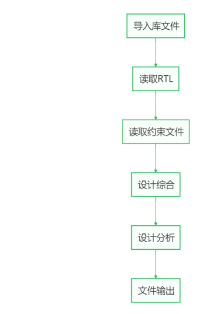
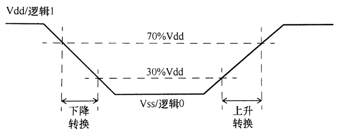
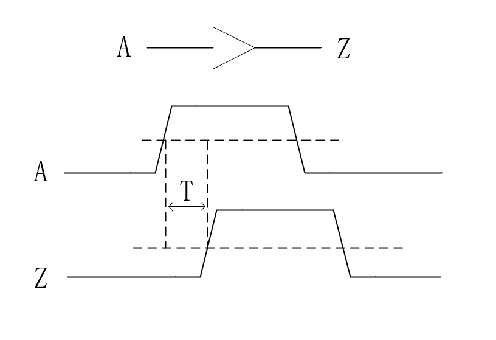
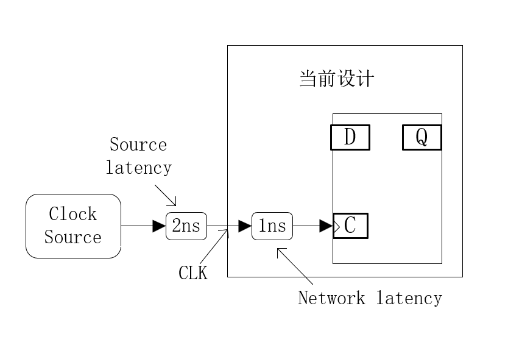
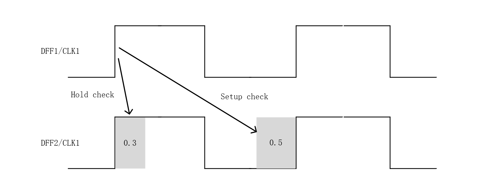
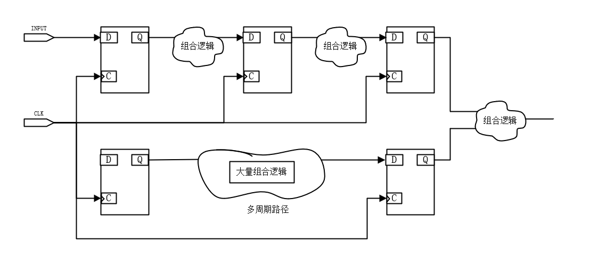
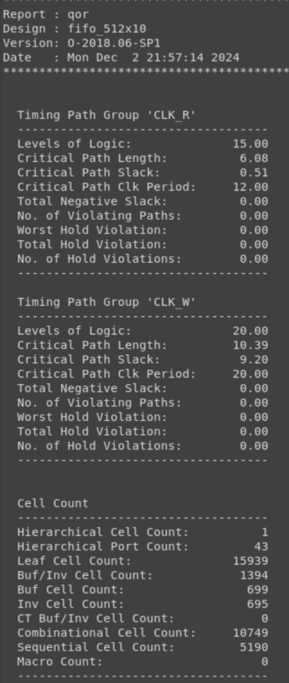
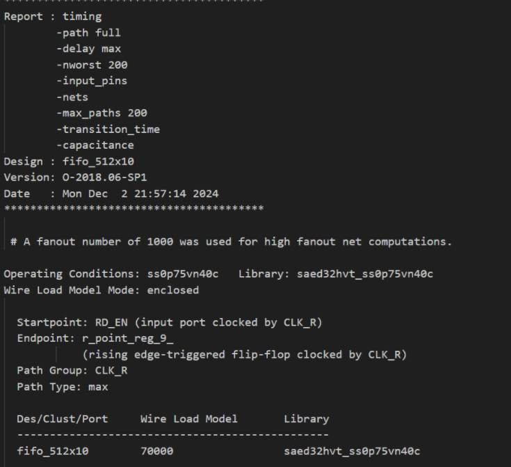

# DC综合
**目标：**
* **使用DC完成逻辑网表生成**
* **使用DC分析网表的质量**

## 综合的介绍
#### 什么是综合
综合（Synthesis）是将行为级的RTL代码在工艺、面积、时序等约束条件下，转化为相应的门级网表的过程。通过综合工具，将硬件设计从高层描述转化为门级电路，并且在这一过程中完成实现与优化工作。具体来说，综合是根据系统的逻辑功能和性能需求，在预先定义的单元库支持下，找到满足功能、速度和面积等要求的最佳逻辑网络结构。

综合通常分为三个主要阶段：转换（translation）、优化（optimization）和映射（mapping）。

1. **转换（Translation）**：在这一阶段，综合工具将高层描述的RTL代码转化为门级逻辑。例如，在Synopsys的Design Compiler（DC）中，这一步会使用gtech库中的门级单元来组成最初的逻辑结构，这些逻辑单元用于实现HDL中的设计描述，形成初步的门级电路。

2. **优化（Optimization）**：在优化阶段，综合工具对初始生成的门级电路进行分析，移除冗余单元，并且对不满足设计约束的部分进行优化。这包括满足设计中的速度、面积和功耗等约束条件，确保电路符合预期性能。

3. **映射（Mapping）**：经过优化的电路接下来会映射到指定的工艺库（由芯片制造商提供）上，使得设计与具体的技术工艺相适配。这一步将优化后的逻辑结构转化为具体的工艺单元，以实现最终的物理电路。

综合工具通过这些步骤，将高层次的行为描述逐步转化为满足具体工艺库的逻辑电路，实现了从代码到硬件的有效转化。
常用工具 ：
* Synopsys: DC（用的较多）
* Candance：Genus
这里我们选用 **Design Compiler** 作为综合工具

#### 综合需要的文件
* RTL文件
* 标准单元的库文件
* 其他库文件。如IO库，IP库等等

不管是什么样子的综合工具，所需要的文件和吐出来的文件基本是一致的，但是里面文件的定义有时候不同，不同的工具可能需要不同格式的库文件  

#### 综合输出的文件
* 综合后的门级网表
* 带时序约束信息的sdc文件
* 其他一些后端需要用的特殊配置，如dont_touch设置等
* 保留综合结果的ddc文件(之后可以直接load这个文件，查看综合结果)

#### 综合输出的文件
- **门级网表文件**
- **带时序约束的 SDC 文件**
- **特殊配置文件**：包含后端所需的特定设置，例如 `dont_touch` 属性，用于保护特定单元不被优化或更改。
- **DDC 文件**：保存综合结果的 DDC（Design Compiler Database）文件。可以在之后直接加载这个文件，以便查看综合结果，或用于进一步的综合操作。

网表和 SDC 文件是后端设计中最关键的文件。具体来说：

- **门级网表文件**：这是综合工具生成的门级逻辑描述，后端使用它来进行版图设计。网表中包含了各个逻辑单元和它们之间的连接关系，是物理实现的基础。

- **SDC 文件（时序约束文件）**：SDC 文件包含了设计中的时序约束信息。后端设计需要这个文件来确保物理实现能够满足时序要求。例如，SDC 文件中通常会指定时钟频率、输入和输出延迟、时钟域的关系、复位等约束。后端工具根据这些约束来优化和调整电路，以达到所需的时序性能。

此外，SDC 文件可能还包括：
  - **时钟约束**：定义设计中的时钟源、时钟频率、时钟周期等。
  - **输入/输出延迟**：用于指定端口的延迟要求，帮助后端在布线时确保时序闭合。
  - **多时钟域约束**：定义不同时钟域之间的时序关系，确保多时钟域设计的稳定性和可靠性。
  - **生成时钟（Generated Clocks）**：用于描述从主时钟派生的次级时钟，这对于后端工具准确进行时序分析非常重要。

这些约束信息有助于后端工具在实现物理布局和布线时，调整逻辑单元的位置和连线，确保时序要求得到满足。最终，门级网表和 SDC 文件一起使得后端工具能够在满足时序、面积和功耗等设计目标的前提下，生成符合工艺库约束的芯片版图。

---

## 综合的基本流程
#### 两种启动DC方式
* dc_shell:命令行方式
    1. dc_shell （一般模式）
    使用wlm(wire load model)模式来计算连线延迟
    2. dc_shell -topo （拓扑模式）
    读取物理信息来计算连线延迟，一般推荐topo模式
* design_vision:图形化界面方式 基本不用）

在项目的早期阶段主要使用wlm模式来综合，因为这个时候还没有通过innovus进行布局布线，项目的后期，当器件位置基本确定了，有了物理信息，使用拓扑模式进行综合，效果更好。
后面的命令都是在dc_shell命令的基础上运行的
#### DC综合的流程


### 第一步、导入库文件
导入的库文件为时序库文件，用于描述物理单元的时序和功耗信息的重要库文件
时序库文件有.db格式和.lib格式，其中.db文件不可读取，保密性更好

每个库文件主要包括：
* 物理单元库的基本属性
    1. 单元库名称、单元库版本以及生产日期等
    2. 定义电压、电流、电容等
    3. 定义电路的传输延时和信号的转换时间的电压百分比
* 每个单元的具体时序与功耗信息

{}
**什么是转换时间？**

数字电路中信号从一个逻辑电平转换到另一个逻辑电平所需的时间。大部分旧工艺的库（0.25um或者更旧）使用10%和90%作为转换时间的阈值，这是根据波形翻转的线性区域而定的，随着工艺的进步，波形的线性区域从10%到90%变为30%到70%。所以目前大部分工艺库使用30%和70%作为转换时间的阈值测量点
{}



{}
**什么是传播延时？**

器件延时也称为传播延时（propagation delay），通过输入信号电压变化的50%到输出信号电压变化50%所需要的时间来定义门传播延时的大小，如图中的时间T
{}



**工具是如何在lib文件中得到各类延迟的值？**  
Look up table 二维查找表
```
table_template(delay_template_2x2) {
            variable_1: total_output_net_capacitance;
            variable_2: input_net_transition;
            index_1 (“10.0, 11.0”);
            index_2 (“10.0, 11.0”);
        }

fall_transition(delay_template_2x2) {
            index_1 (“0.1500, 0.1950”);
            index_2 (“0.0275, 0.03580”);
            values(“0.1906, 0.2338”, \
                   “0.1908, 0.2338”
        }
```
index_1代表行，index_2代表列，工具通过这两个对应的数，来查找lib中的表，确定延时的值  
**如何计算一个cell的延迟大小？**  
二维查找表时需要知道两个值  
**输入pin的`input transition`**  
**输出pin的`output load`**

我们这里用的是SAED 32/28nm的库

在综合和时序分析中，时序库的精度直接影响时序结果的准确性。时序库有多种模型来描述标准单元的延时和功耗特性，其中**NDLM（Nonlinear Delay Model）** 和 **CCS（Composite Current Source）** 是两种常见的延时模型。它们在不同的分析阶段、精度要求和特性描述上有所不同，理解它们的区别有助于选择合适的模型进行设计。下面是对这两种模型的补充说明。

##### 1. **NDLM（Nonlinear Delay Model，非线性延迟模型）**
NDLM是一种**传统的查找表模型**，它基于非线性函数，通过查找表（lookup table, LUT）来描述标准单元在不同输入条件下的延时特性。具体来说，NDLM模型使用单元的输入转换时间（slew）和输出负载电容（load capacitance）作为查找表的索引，来计算相应的延时和输出转换时间。

- **工作原理**：
  NDLM 通过两个2D查找表来描述单元延时：
  1. **延时表（delay table）**：给出输入信号传播延时，输入是输入的转换时间和输出负载电容。
  2. **转换时间表（slew table）**：给出输出信号的转换时间，同样以输入转换时间和输出负载电容为输入。

- **优点**：
  - 简单、高效，计算速度快。
  - 在综合阶段广泛使用，因为模型相对简单，能快速估算设计的时序特性。

- **缺点**：
  - 对于信号完整性和复杂的电气效应（如电压降、噪声效应等）描述不够精确。
  - 对实际电流波形的捕捉较弱，只能近似描述延时和转换时间。
  - 在精确的时序分析中可能出现误差，尤其在先进工艺节点下。

##### 2. **CCS（Composite Current Source，复合电流源模型）**
CCS 是**一种基于电流源的时序和功耗模型**，相比NDLM，CCS更加精确，特别适合用来描述复杂的电气效应和信号完整性问题。CCS模型不仅考虑了延时和转换时间，还考虑了电流波形和电压波形的变化，以便在更复杂的设计条件下进行精确的时序和功耗分析。

- **工作原理**：
  CCS 使用**电流波形和电容效应**来描述标准单元的行为。它模拟输入信号的电流响应来计算延时和转换时间，因此可以精确地描述诸如过冲（overshoot）、下冲（undershoot）、噪声等复杂现象。
  
  - **CCS-Timing**：用于描述时序的精确模型。它不仅考虑输入转换时间和输出负载电容，还基于电流和电压波形的细粒度模拟来推算延时和转换时间。
  
  - **CCS-Noise**：用于分析信号完整性问题，能更精确地捕捉噪声效应。

  - **CCS-Power**：用于功耗分析，精确模拟电流波形可以更准确地计算动态功耗和漏电流。

- **优点**：
  - 高精度：CCS 模型能够更精确地捕捉复杂电气效应，例如电流波形、电压波形的变化，适合用于高级时序和信号完整性分析。
  - 对复杂的工艺条件和信号完整性问题（如 IR drop、噪声等）具有更好的支持。
  - 在深亚微米工艺和FinFET等先进工艺节点下，能更好地捕捉真实的电气行为。

- **缺点**：
  - 计算复杂度较高，因此分析速度相比NDLM较慢，特别是在综合阶段，CCS不如NDLM高效。
  - 对设计资源的消耗较大（更多计算时间和存储空间）。

##### 3. **NDLM 与 CCS 的对比**

| **特性**         | **NDLM**                           | **CCS**                           |
|------------------|-----------------------------------|-----------------------------------|
| **模型基础**     | 基于查找表（lookup table）         | 基于电流源和电流波形             |
| **描述内容**     | 仅描述延时和转换时间               | 描述电流波形、时序、功耗、噪声    |
| **精度**         | 中等精度，适合简单时序分析         | 高精度，适合复杂电气效应分析      |
| **分析速度**     | 快速，适合综合阶段使用             | 较慢，适合物理设计和精确时序分析   |
| **适用场景**     | 综合阶段、早期设计                 | 时序优化、物理设计、信号完整性分析 |
| **工艺适应性**   | 对深亚微米工艺和先进工艺支持较弱   | 对先进工艺有很好的支持            |

##### 4. **NDLM 和 CCS 在设计中的应用**
- **综合阶段**：通常使用NDLM模型，因为它计算速度快，能够快速对设计进行时序分析并生成符合基本时序约束的网表。这时候，线延时是基于估算的，所以使用NDLM的简单模型就足够。
  
- **物理设计阶段**：在布局布线完成后，线延时精确可知，因此需要更高精度的时序分析。此时，CCS模型通过模拟电流、电压波形，可以捕捉电路中的电气效应，如过冲、反射、噪声等。这种精确的分析对于高级工艺节点（如FinFET）下尤为重要。

- **信号完整性和功耗分析**：在设计的后期阶段，特别是对于复杂设计，CCS模型由于能够模拟电流波形的变化，还可以用来进行噪声分析和功耗分析，从而帮助优化电源分配和减少功耗。

NDLM和CCS模型在设计综合和时序分析中的应用各有侧重：

- **NDLM模型**：适合在早期综合阶段使用，因为其计算速度快，能快速给出基本的时序估算，特别是在综合阶段，不需要考虑复杂的电气效应。
  
- **CCS模型**：则适合用于后期物理设计和优化阶段，因为它提供了更高的精度，尤其是在深亚微米工艺和先进工艺节点中，通过模拟电流和电压波形，能够更好地进行时序、功耗和噪声的综合分析。

我们这里选用ndlm的库作为综合的库

我们以下面这个库为例
saed32`rvt_ss0p75v25c`.db 


在32/28纳米技术节点中，功耗和时序性能是设计工程师特别重视的关键指标。通过将多阈值电压设计引入综合流程，能够有效提升芯片的整体表现。

每种单元库的性能都可以通过PVT角（`工艺、电压、温度，即Process, Voltage, Temperature`）进行表征，以确保在不同制造条件和工作环境下对芯片的性能进行全面评估。

---

##### 表征角
| 条件 | 工艺 - 工艺 | 电压 (V) | 温度 (℃) |
|---|---|---|---|
| `ttlp05v25c` | Typical-Typical | 0.75 | 25 |
| `ttlp05v125c` | Typical-Typical | 0.75 | 125 |
| `ttlp05vn40c` | Typical-Typical | 0.75 | -40 |
| `ss0p75v25c` | slow - slow | 0.75 | 25 |
| `ss0p75v125c` | slow - slow | 0.75 | 125 |
| `ff0p85v25c` | fast - fast | 0.85 | 25 |
| `ff0p85v125c` | fast - fast | 0.85 | 125 |
| `ff0p85vn40c` | fast - fast | 0.85 | -40 |

---
##### 工艺
* Slow-Slow (SS) 表示工艺角度较差，代表最慢的性能和最低的功耗。
* Fast-Fast (FF) 表示工艺角度最佳，意味着最高性能，但也可能伴随较高的功耗。
* Typical-Typical (TT) 是工艺的标准条件，代表最常见的制造条件。

##### 电压
其中“saed32”后面的部分代表电压阈值的分类标签。根据不同的电压阈值，所有单元库可分为以下三种类型：

- **高电压阈值（HVT）**：HVT单元主要用于降低漏电功耗，但其面积相对较大。
- **低电压阈值（LVT）**：LVT单元具有最快的速度，适合用于对时序要求严格的设计场合。
- **常规电压阈值（RVT）**：RVT单元的性能和功耗介于HVT和LVT之间，属于折中选择。

#####  **通常电压越高。器件的delay越小**

##### 温度
一般情况下，器件的delay是随着温度的升高而增大
但是随着工艺尺寸的降低，关于器件延迟与温度的关系，存在温度反转效应，即随着温度的降低，delay增大

在Design Compiler（DC综合）中进行设计时，选择合适的库来进行时序和功耗的权衡至关重要。通常情况下，在综合阶段我们会选择最慢的库，这是为了在后续的优化流程中预留足够的设计余量。所以我们一般选用ss0p75vn40c来进行综合。

{}
**为什么选用最慢的库**  
因为综合阶段的线延时是基于估算的，并不是物理设计之后的精确布线延时，我们在这个时候只要关注setup时序(hold时序可以在后期通过添加buff修复），所以为了给后续的设计留足裕量，我们一般选用最慢的库来保证能满足setup的时序要求。
{}

确定了使用的库文件，接下来是具体的设置

**设置search path**
```tcl
dc_shell> set search_path [list \
                               ./ \
                               ../ \
                               XXX/XX \
                          ]
```
软件会在serch path的目录下搜索文件，简化了路径的编写

**设置target library和link library**    
Target library（目标库）：一般指标准单元库，是DC用来做综合映射的目标库

Link library（链接库）：门级网表实例化的参考库，设计中的所有单元都来自于link library。link library除了标准单元以外，还包含IO库文件，IP库文件等

在 link_library 的设置中必须包含"\*"， 表示 DC 在引用实例化模块 或者单元电路时首先搜索已经调进DC memory的模块和单元电路，如果在link library 中不包含"\*"，DC 就不会使用 DC memory 中已有的模块，因此，会出现无法匹配的模块或单元电路的警告信息(unresolved design reference)。

**如何设置target_library和link_library？**
```tcl
dc_shell> set target_library   [list saed32hvt_ss0p75vn40c.db]
dc_shell> set link_library     [list "*" saed32hvt_ss0p75vn40c.db]
```

### 第二步、读取RTL
DC支持多种RTL语言，包括verilog、VHDL等
在使用 Design Compiler 进行综合时，我们有两种常见的方式来读取 RTL 文件：
read_verilog和analyze & elaborate
- **方法1：read_verilog**  
```tcl
dc_shell> read_verilog rtl_file1.v
dc_shell> read_verilog rtl_file2.v
```
或者
```tcl
dc_shell> read_verilog {rtl_file1.v rtl_file2.v}
```
current_design XXX（XXX代表top module的名字），这个命令用来告诉DC去综合哪个模块。

接下来输入
```tcl
dc_shell> current_design MY_TOP
```
current_design XXX（XXX代表top module的名字），这个命令用来告诉DC去综合哪个模块。

接下来使用link链接工艺库，通过输入命令
```tcl
dc_shell> link
```
导入link library，通过这个命令让工具去检查，设计里的所有设计对象，都有对应的时序模型。

- **方法2：通过analyze & elaborate**  
除了`read_verilog`，我们还可以使用`analyze`和`elaborate`命令来完成文件的读取和模块展开。
```tcl
dc_shell> analyze -format verilog my_design.v
dc_shell> elaborate top_module
```
通过这种方式，也可以读取system verilog等其它的RTL，只要替换-format后的为sverilog等其它形式的语言。elaborate这个命令包含了current_design和link的功能，所以我们不用再去执行current_design和link操作。
并且`elaborate是唯一在读取设计的时候修改参数的方法`
比如说我们在代码里面定义了两个参数
```verilog
module TOP (A, B, C ···);
    parameter A_width 3;
    parameter B_width 5;
    input [A_width-1:0] A;
    input [B_width-1:0] B;
    ·······
```
然后我们可以通过
```
dc_shell> elaborate TOP -parameters "A_width=5, B_width=16"
```
来修改参数，这些参数的值会覆盖RTL代码中的默认参数值，但是我们一般不推荐通过这种方法去修改参数，因为这样不能保证代码的一致性，不容易查错。

### 第三步、读取约束文件
这一步是读取SDC文件，SDC 全称：Set Design Constraints主要用于：定义时序约束（如时钟、延迟、多周期路径、假路径等）和物理约束（如面积等），指导设计工具进行优化和分析。

在集成电路设计流程中，**RTL代码**主要描述了电路的**逻辑功能**，包括寄存器之间和输入/输出端口之间的**组合逻辑**。然而，RTL代码并没有明确涉及到设计中的**时序信息**和**物理信息**，例如路径的延时和电路面积。为了弥补这些信息的缺失，设计师会通过SDC文件来为设计提供**时序和物理约束**。

SDC文件是基于Tcl（Tool Command Language）的约束文件格式，它的主要有两类设计约束：


**设计约束主要分为两类：**

**1. 设计规则约束**
- 设计规则约束是基于特定工艺的限制，要求设计必须满足这些规则才能确保功能正常。这些约束通常与制造工艺相关，如线宽、间距、电压要求等。
- 大多数技术库（Technology Library）都会预先定义默认的设计规则，这些规则是根据制造工艺的能力和限制制定的。
- 虽然可以在设计中应用比默认更严格的规则，但不能使用比默认规则更宽松的要求。这确保了设计的可制造性和功能性。

**2. 设计时序与面积约束**
- 常见的优化目标包括时序（速度）和面积。
- 在大多数情况下，时序约束优先于面积约束，即优先确保设计能够满足速度要求，随后再考虑面积的最小化。但优先级可以根据需求进行调整。
- 时序约束的前提是满足设计规则约束，也就是说，优化是建立在符合工艺要求的基础上进行的，不能违背基本的设计规则。

下面是两种约束的具体命令与介绍：
首先我们要了解一些基础的命令：
 1. **get_design**
- **功能：** `get_design` 用于获取当前设计的模块名称。通常在进行设计综合时，我们需要知道当前模块的名称，以便进行后续的优化和约束操作。
  
  **例子：*
```tcl
dc_shell> get_design
```
  **输出：** 当前设计的顶层模块名称。

 2. **get_clock**
- **功能：** `get_clock` 用于获取设计中定义的时钟信号。在时序分析和时钟约束时，时钟是一个非常关键的元素。通过这个命令，可以找到已经创建的时钟名称。
  
  **例子：**
```tcl
dc_shell> get_clock my_clock
```
  **输出：** 时钟 `my_clock` 的信息。

3. **get_pins**
- **功能：** `get_pins` 获取实例化模块中连接的具体针脚（pin）。这些针脚对应了逻辑单元中的输入和输出。例如，实例化后的模块可能包含多个输入输出端口，`get_pins` 命令可以用于查询这些端口内部的实际连接。
  
  **例子：**
```tcl
dc_shell> get_pins sum_u2/a
```
  **输出：** 获取实例化单元 `sum_u2` 的 `a` 端口。

4. **get_ports**
- **功能：** `get_ports` 用于获取当前模块的端口（port）。端口是模块的外部接口，主要用于和其他模块通信。通过该命令可以列出当前模块的所有输入输出端口。
  
  **例子：**
```tcl
dc_shell> get_ports in1
```
  **输出：** 获取当前模块的 `in1` 端口。

5. **get_net**
- **功能：** `get_net` 用于获取设计中的信号线（net）。在电路设计中，net 代表了连接在一起的各个针脚或端口之间的电气连接。`get_net` 可以帮助我们定位某条信号线的具体名称，这对时序分析和布线非常重要。
  
  **例子：**
```tcl
dc_shell> get_net my_net
```
  **输出：** 获取信号线 `my_net` 的信息。

6. **get_cell**
- **功能：** `get_cell` 获取设计中实例化的单元（cell）。这些单元通常是库中的基本逻辑单元（如与门、或门等）或更高级的模块，实例化后有独立的名字。`get_cell` 可以帮助我们定位这些实例化的逻辑单元。
  
  **例子：**
```tcl
dc_shell> get_cell U111
```
  **输出：** 获取实例化单元 `U111` 的信息。

**Pin 与 Port 的相对性**
- **Port** 通常是指模块的外部接口，它定义了模块与外部其他模块或电路的连接点。
- **Pin** 是指模块内部单元（cell）的连接点，通常是逻辑单元的输入或输出。
  
它们的区别在于上下文的不同。当我们讨论顶层模块时，端口（port）指的是模块的输入输出接口；而在实例化模块内部时，这些端口可能会作为内部单元的针脚（pin）来处理。因此，**pin 和 port 是相对而言的**，根据设计的层次结构和观察的视角不同，可能是相同的物理连接点，但在不同上下文中名称有所不同。

**例子**
比如我们有一段代码
```verilog
module top_module (
input wire clk, // 时钟信号
input wire in1, // 输入信号1
input wire in2, // 输入信号2
output wire out // 输出信号
);
wire sum; // 内部信号，用于连接实例化模块的输出

// 实例化一个加法器模块 (adder_u1)，将输入 in1 和 in2 相加，并将结果传给 sum
adder adder_u1 (
.a(in1), // 输入a，连接顶层输入in1
.b(in2), // 输入b，连接顶层输入in2
.sum(sum) // 输出sum，连接到内部信号sum
);

// 将内部信号sum赋值给顶层输出out
assign out = sum;

endmodule

// 定义加法器模块
module adder (
input wire a, // 加法器的输入a
input wire b, // 加法器的输入b
output wire sum // 加法器的输出sum
);
// 执行逻辑加法操作
assign sum = a + b;
endmodule
```
假设我们有一个设计模块 `top_module`，其输入端口为 `in1` 和 `in2`，输出端口为 `out`，并且内部实例化了一个加法器模块 `adder_u1`，它的输入端口为 `.a`, `.b`，输出端口为 `sum`。我们还定义了一个时钟信号 `clk`。

1. **获取当前设计模块：**
```tcl
dc_shell> get_design
```
   **输出：** `top_module`

2. **获取时钟信号：**
```tcl
dc_shell> get_clock clk
```
   **输出：** `clk` 的时钟信息。

3. **获取内部实例化的针脚：**
```tcl
dc_shell> get_pins adder_u1/a
```
   **输出：** `adder_u1` 模块的 `a` 端口。

4. **获取顶层模块的端口：**
```tcl
dc_shell> get_ports in1
```
   **输出：** 顶层模块的 `in1` 端口。

5. **获取信号线：**
```tcl
dc_shell> get_net net_1
```
   **输出：** `net_1` 信号线的信息。

6. **获取实例化单元：**
```tcl
dc_shell> get_cell adder_u1
```
   **输出：** 实例化的加法器 `adder_u1` 的信息。

通过这些命令，你可以轻松查询和管理设计中的模块、端口、针脚、时钟和信号线等信息，以实现对电路设计的全方位控制。

**接下来是具体的规则设置：**
### **设计规则约束**
**1. Maximum capacitance (最大电容)**
```tcl
dc_shell> set_max_capacitance cap_value port_list
```
-  这是一个针脚级别的属性，用于定义一个输出管脚可以驱动的最大总电容负载。

**2. Maximum transition (最大转换时间)**
```tcl
dc_shell> set_max_transition trans_value port_list
```
- 从理论上来说，只要输入电平变化了，不管输出带了多大的负载，经过一段时间，总是能够使输出电 平变化的，但是上升或下降时间长就意味着电路的速度很慢。
- 定义一个网络的最大转换时间，这是驱动管脚改变逻辑值所需的最长时间。
  
**3. Maximum fan-out (最大扇出)**
```tcl
dc_shell> set_max_fanout value port_list
```
- 一个网络的最大扇出负载是该网络可以驱动的最大负载数量。如果库中存在扇出约束，并且指定了最大扇出属性，设计编译器会尝试满足最严格的要求。

---
---
### **设计时序与面积约束**
1.**创建时钟**
用于定义时钟的周期和波形。
命令：
```tcl
dc_shell> create_clock -name "clk name" source_objects \ -period period_value -waveform {rise fall}
```
* source_objects： 时钟应用的针脚或端口列表。
* -period period_value： 时钟波形的周期，单位为库中的时间单位。
* -waveform 选项： 设置上升沿和下降沿的时间。如果不指定波形，默认波形为50%的占空比。
示例：
```tcl
dc_shell> set cycle 10.0
dc_shell> create_clock -name "clk_1"  [get_ports clk_1] -period $cycle -waveform {0 5} 
#因为库里的时间单位是ns，所以这里创建了一个占空比为50%的100Mhz的时钟
```
这样我们就创建了一个时钟，但是这样的时钟是理想的，我们可以添加一些设置来让时钟更接近实际的情况。

1.1**时钟延迟 (Clock latency)**
`用来定义时钟到寄存器的延时`
* **网络延迟（Network latency)**：从时钟引脚到寄存器时钟引脚的延迟 
 ```tcl
dc_shell> set_clock_latency delay [get_clocks clk]
#设置时钟的延迟。
dc_shell> set_clock_latency -fall delay [get_clocks clk]
#设置时钟下降沿的延迟。
dc_shell> set_clock_latency -rise delay [get_clocks clk]
#设置时钟上升沿的延迟。
```
* **源延迟 (Source latency)**：从时钟源到时钟引脚的延迟
```tcl
dc_shell> set_clock_latency delay -source [get_clocks CLK]
#设置从时钟源到时钟引脚的延迟。
dc_shell> set_clock_latency delay -source -early [get_clocks CLK]
#设置用于建立时间（setup time）检查的时钟源延迟。
dc_shell> set_clock_latency delay -source -late [get_clocks CLK]
#设置用于保持时间（hold time）检查的时钟源延迟。
```
例子：

```tcl
dc_shell> set_clock_latency  –source 2.0 CLK
dc_shell> set_clock_latency 1.0 CLK
```

1.2.**时钟不确定性 (Clock uncertainty，偏斜 Skew)**  
` 寄存器处时钟信号到达的最大差异 `
这里的uncertainty一般由时钟的抖动（jitter）+ setup或者hold margin组成  
建立时间（Setup Time）与保持时间（Hold Time）
- **建立时间**是指数据端信号在时钟有效边沿到达之前必须提前到达的最小时间。
- **保持时间**是指在时钟有效边沿之后，数据端信号必须保持稳定的最小时间。
这两个参数由工艺库提供，确保数据信号能够被正确读取并存储。

**时钟树或多个时钟域导致的延迟差异**  
**单时钟不确定性（Single clock uncertainty）**  
```tcl
dc_shell> set_clock_uncertainty delay [get_clocks CLK]
#设定单个时钟的不确定性延迟。
```
**跨时钟不确定性（Interclock uncertainty）**  
```tcl
dc_shell> set_clock_uncertainty delay -from [get_clocks CLK1] -to [get_clocks CLK2]
#设定从时钟域1到时钟域2的跨时钟不确定性延迟。
```
例子
  
```tcl
dc_shell> set_clock_uncertainty -setup 0.5 CLK1
dc_shell> set_clock_uncertainty -hold 0.3 CLK1
```

1.3. **转换时间 (Transition time)**  
`信号从低到高或从高到低变化所需的时间，输入的转换时间影响输出延迟和输出的转换时间`
```tcl
dc_shell> set_clock_transition delay [get_clocks CLK]
#设置时钟的转换时间（从低电平到高电平或从高电平到低电平的切换时间）。
dc_shell> set_clock_transition delay -fall [get_clocks CLK]
#仅设置时钟下降沿的转换时间。
dc_shell> set_clock_transition delay -rise [get_clocks CLK]
#仅设置时钟上升沿的转换时间。
```

2.**输入与输出延时**  
在数字电路设计中，`set_input_delay` 和 `set_output_delay` 命令用于定义输入和输出信号在模块之间的允许到达时间，特别是在路径跨越模块边界时。这些命令确保信号在时钟有效边沿到达时序单元，从而满足设定的时序要求。
```tcl
dc_shell> set_input_delay -clock clk_name -max max_value -min min_value
dc_shell> set_output_delay -clock clk_name -max max_value -min min_value
```

2.1. `-max` 选项
* 此选项用于指定输入或输出信号的最大延迟，以满足时序单元的建立时间要求。这意味着信号必须在时钟边沿之前的特定时间内到达，以确保数据的有效性。

2.2. `-min` 选项
* 此选项用于指定输入或输出信号的最小延迟，以满足时序单元的保持时间要求。这确保了在时钟有效边沿之后，数据在一段时间内不会改变，从而避免读取错误。

2.3. 输入与输出延迟的计算
- 输入与输出路径的最大延迟限制了信号到达的最晚时刻，必须根据时序单元的时序要求进行计算。通过合理设置最大和最小延迟，可以有效控制信号的时序行为，从而确保整个设计的时序可靠性。

 `一般设置：在实际设计中，通常将输入与输出延时设置为时钟周期的60%。这一设置帮助优化电路性能，确保信号在规定的时间范围内正确到达。`

3.**组合电路多周期路径约束**  
一个时序路径，它的信号传播不要求在一个时钟周期内完成。通常，所有路径都被限制为单周期时序。多周期路径是默认单周期时序的例外情况。设置多周期路径是为了指示编译器允许数据沿路径传播时使用多个时钟周期



```tcl
dc_shell> set_multicycle_path path_multiplier –from $start_point –to $end_point [-setup] [-hold] [-start] [-end]
```
选项定义：  
path_multiplier: 指定周期数量  
\$start_point: 指定多周期路径的起始点（时钟、端口、引脚或单元）  
\$end_point: 指定多周期路径的终点（端口、引脚或基本单元）  
-setup: 用于设置时间计算  
-hold: 用于保持时间计算  
-start: (时钟发射边)(保持检查默认)：指示多周期信息相对于起始时钟  
-end: (时钟捕获边)(设置检查默认)：指示多周期信息相对于终止时钟  

4.**设置false路径**  
在异步电路中，时序关系由协议保证，因此用户在设计时需要确保电路正常工作。为此，用户必须明确指出跨越异步电路的路径，以便优化工具能够正确处理这些路径。
```tcl
dc_shell> set_false_path -from source -to destination
```
set_false_path 命令用于在电路设计中标识那些不需要考虑的路径，这些路径通常是异步电路的路径或者逻辑上不存在的路径。在综合和优化过程中，对这些路径的时序限制将被忽略，从而提高综合工具的优化效率。  
**示例**
```tcl
dc_shell> set_false_path -from write_en -to read_en
```
这条命令表示在优化过程中，综合工具将忽略从 write_en 到 read_en 的路径的所有时序限制。
在使用不同时钟源的情况下，某些信号路径被视为异步路径。例如，如果 CLKA 和 CLKB 属于不同的时钟晶振，可以使用以下命令：
```tcl
dc_shell> set_false_path -from [get_clocks CLKA] -to [get_clocks CLKB]
```
这条命令表明 CLKA 到 CLKB 的路径是异步的，优化工具在处理该路径时将不会考虑其时序约束。

5.**设置面积约束**  
在集成电路设计中，芯片面积与成本直接相关，面积越大，制造成本越高。因此，设计师通常希望尽量减小芯片面积，以降低整体成本。set_max_area 命令用于限制综合过程中电路的面积，以优化设计。
```tcl
dc_shell> set_max_area area_value
```
如果将 max_area 设置为 0，综合工具将不会满足面积要求，但会尽量优化电路以达到可能的最小面积。这种情况下，虽然综合后的电路面积最小化，但电路的“弹性”会受到限制，可能会影响后续的设计修改和性能优化。

---
完成sdc文件之后，采用source或者read_sdc命令读入sdc文件
```tcl
dc_shell> source top.sdc
dc_shell> read_sdc top.sdc
```
推荐使用source命令来读取sdc文件，因为read_sdc不识别remove_from_collection等的tcl命令

### 第四步、设计综合  
我们已经有了RTL代码、时序库与约束文件，综合需要的文件已经准备完成，接下来就是进行设计综合。DC综合命令：
```tcl
dc_shell> scompile_ultra  
```
采用该命令可以让DC开始执行综合过程，综合执行三级的优化：
* 架构级（Architectural-level）或高层次综合（high level synthesis）
由于芯片的架构都是确定的，所以在架构级工具优化起来不是那么容易，但是工具也会尽力去优化一部分电路，让整体效率更高，速度更快。
* 逻辑级（Logic-level）或GTECH优化
工具会尽可能使用简单的逻辑去进行综合，减少电路的面积与级数。
* 门级（Gate-level）or映射优化
工具会尽可能的去优化每一个cell的面积与时序。

在满足时序和其它约束时，工具也会尝试最小化面积

对于compile_ultra命令，有一些常见的综合参数设置：
* **关键路径重点优化**
通过grop_path, 并提升path group的weight权重
```tcl
dc_shell> group_path –name INPUTS –from [all_inputs] –weight 1
dc_shell> group_path –name OUTPUTS –to [all_outputs] –weight 1
dc_shell> group_path –name REG2REG –from [all_registers] –to [all_registers] 3
dc_shell> group_path –name CLK –to CLK_A –weight 5
#将权重5应用于关键的路径（比如timing较差的group）
#将权重2应用于其他的关键的路径（reg to reg）
#默认权重为1分配给所有其他路径（例如不准确的I/O路劲）
```

* **打平优化**

compile_ultra默认启用打平优化，如果想关闭，可以添加`–no_autongroup`，
比如现在有3个module，A和B是top底下的module，由于综合的时候，不同的module处于不同的文件，不同的电路模块就会形成不同的层次结构，在综合时候，由于这种层次的存在，所以工具会尽可能的优化同一个层次的结构，层次与层次之间的电路，虽然说他们是同一条路劲，但因为不是同一个层次，那他们之间的优化效果可能就不是很好，所以在综合的时候使用compile_ultra，工具就会把电路的所有层次去掉，他就是将全部都放到一起，就不存在这种边界的问题了，由于这种边界消失了，就是说大家都放到一起了，那么这种优化出来的时序就会更好一些了，但是采用这种方式虽然有优点，但是缺点也比较明显，就是因为去掉了层次结构，那么前端工程师来看做好的代码，就不是很容易看出对应的关系，因为cell的名字变了，就不知道这个cell是由哪个verilog文件变的，不利于做ECO

* **边界优化**
```tcl
dc_shell> compile_ultra –no_boundary_optimization
```
边界优化，类似于刚才的打平优化，将模块之间的边界模糊化，模糊化之后呢，也是时序和面积会更好，但是缺点和打平优化一样，不方便后期的修改

* **寄存器复制**
```tcl
dc_shell> compile_ultra –timing
```
寄存器复制，也叫clone，比如说现在有一i个寄存器后面连接了200个寄存器，那么连了200个寄存器之后，就会导致他的时序路劲很长，中间也可能有很多的buffer，那么他的时序路径很长的话，他的setup就不是很好满足，这种情况下，这个命令就可以让工具复制出几份一模一样的寄存器，也就是把原来的200个进行分组，分组之后呢，寄存器之后的fanout少了，这样就可以解决由于fanout过大带来的timing的问题

* **ICG优化**
```tcl
dc_shell> compile_ultra –gate
```
ICG同样可以采用clone和declone的形式去优化，比如如果ICG的fanout过大，同样会导致timing的问题，同样采用clone的操作去复制几个一模一样的寄存器分别去挂不同的负载，减少fanout数目，解决时序问题，然后delone就是一些ICG后面的fanout过少，由于ICG的面积还是挺大的，这样就会导致面积上的浪费，比如说工具认为这两个ICG合在一起是没有问题的，那么就会把他们合在一起，来减少面积
```tcl
dc_shell> set_clock_gating_check –setup 0.02
```
然后我们可以采用set_clock_gating_check进一步优化ICG的timing，通过这样的一个操作让ICG的EN端的timing检查变得更严格，工具就会去加强这一块的优化，让它的timng更容易满足要求，我们在STA的时候会有一个问题，clock_gate上会有一个EN端，EN端打开的时候，clock就会从ICG穿过去，如果EN是0的话，后面就是恒定的低电平，EN端前面一般是一个寄存器去控制的，这个时候会出现一个特殊的时序路径，就是reg到ICG的路径，而在后端设计里面，这个reg到ICG的路劲是十分不好满足的，也就是在我们设计过程中，如果设计没什么的问题的话，最后的时序问题一般都是reg到ICG的时序路劲的问题，这里面就涉及到为什么reg到ICG的路劲不好满足， 首先就是这个clock_gate在时钟树中的位置， 他是处于别的东西的时钟路径上的，他是控制后面的寄存器后者其他一些东西的时钟的开与关，所以它肯定是在时钟树的前面，也就是ICG上的时钟天生要比寄存器的时钟短了一截，而ICG的EN又是由一个寄存器控制的，这个寄存器的时钟树一般是要和别的进行balance的，ICG的时钟是capture_clock ， 那么capture_clock 越长对setup越有利，由于它的时钟天生比reg的短一些，所以他的时序就更难满足

* **增强优化**
```tcl
dc_shell> compile_ultra –incremental
```
增强优化，它做的是在当前的基础上继续进行优化，也就是说工具会采取之前的那些优化策略继续优化,

* **优化面积**
```tcl
dc_shell> optimize_netlist
```
优化面积，采用这个命令可以在不影响时序的基础上，在非关键路径上选用尺寸小的单元或者优化逻辑，进一步减少面积，这些也就是传统的逻辑综合用的优化策列和优化方法。

### 第五步、设计分析  
```tcl
check_design
```
用check_design检查设计中是否存在其他隐患问题
```tcl
check_timing
```
用check_timing检查设计中是否有路径没有被约束，每一条路径都应该约束到，如果真的有哪一条不需要约束也应该设置成false path。
```tcl
report_qor
```
用report_qor查看整体综合后的summary结果
```tcl
report_area
```
用report_area查看综合后得到的面积
```tcl
report_timing
```
用report_timing查看具体的setup/hold时序信息。
**具体案例分析**  



我们可以先看qor报告，首先关注时序，其次是面积，对于timing的情况，我们主要看Critical Path Slack、Total Negative Slack和No. of Violation Path这三个值，综合阶段不一定要修完所有的Violation，因为这个阶段的线延迟是不准的，只要结果不会超过太多，可以不修。
接着可以看report_timing出来的具体报告，进一步分析最差的path的情况



### 第六步、文件输出
1. 保存网表
```tcl
write_file -f verilog -output xxx.v
```
2. 保存ddc文件
```tcl
write_file -f ddc -output xxx.ddc
read_ddc xxx.ddc
```
ddc文件是dc的数据格式，保存后下次可以直接加载查看结果。不需要重新综合。可以通过read_ddc命令直接读取
3.写出综合后的sdf文件
```tcl
write_sdc xxx.sdc
```

