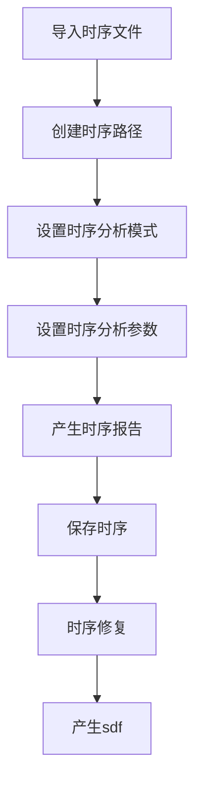
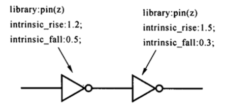
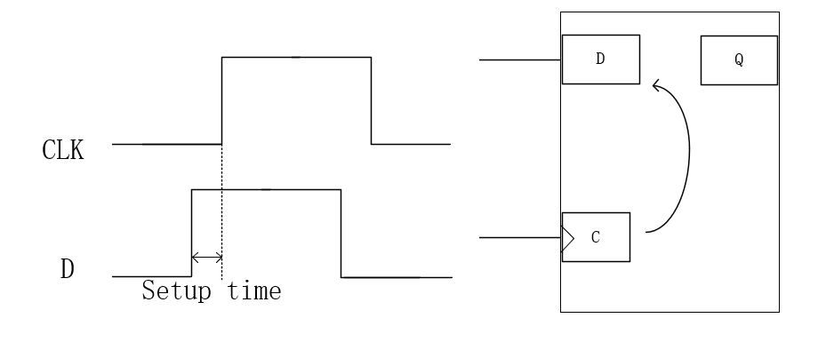
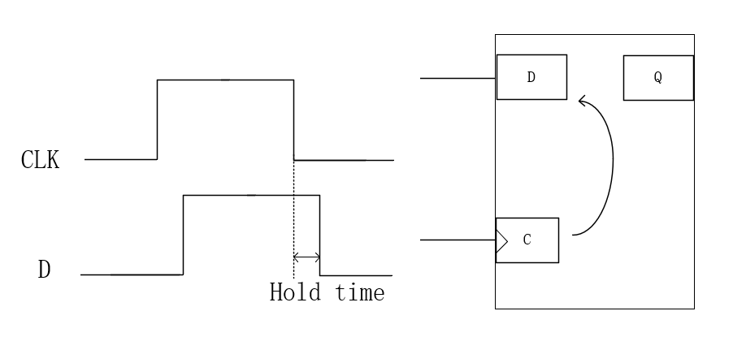
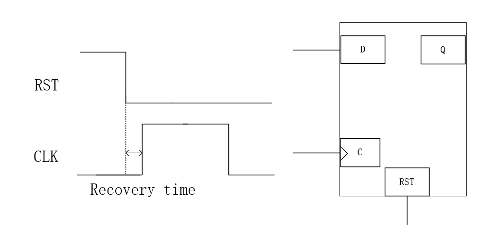
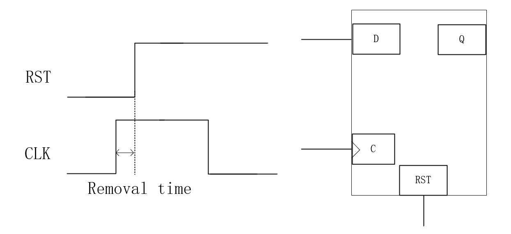
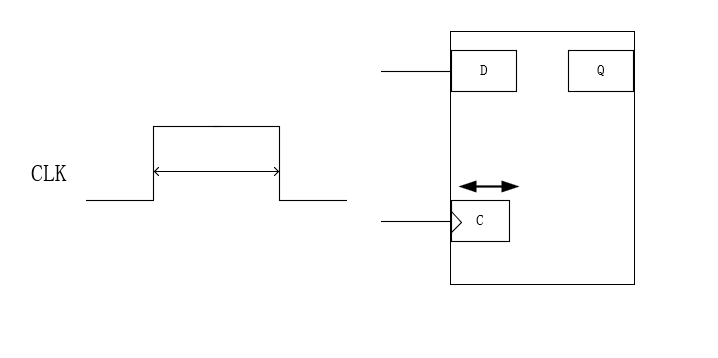

# 静态时序分析
## STA概述
静态时序分析（STA）是通过工具对同步电路中所有存在的时序路径进行分析，检查是否存在时序违例，是标准的timing Sign off方法
`主要都是针对同步电路`
时序的验证方法:
* 动态时序分析（Dynamic timing simulation）
* 静态时序分析（Static Timing Analysis）
#### 动态时序分析（Dynamic Timing Analysis, DTA）
1. **方法特点**： 
   - 基于仿真方法，通过施加具体输入测试向量，验证设计在特定条件下的时序行为。
   - 需要设计功能和测试向量的配合。
2. **优势**： 
   - **功能覆盖**：能够验证特定输入条件下的时序行为。
   - **精确性**：仿真电路的真实响应，能发现实际条件下的潜在问题。
3. **劣势**：
   - **依赖测试向量**：质量（覆盖率）取决于输入测试向量的全面性。 
   - **仿真时间长**：随着测试向量数量增加，仿真时间显著增长。
4. **适用场景**： 
   - 用于验证复杂场景下的时序问题。 
   - 适合后仿真阶段的功能和时序联合验证。

---
#### 静态时序分析（Static Timing Analysis, STA）
1. **方法特点**：
   - 采用穷举型逻辑，通过计算电路中所有可能路径的时序约束来验证设计的时序完整性。 
   - 不需要特定输入向量，独立于信号值。
2. **优势**： 
   - **全面性**：STA 对设计中的所有路径进行分析，确保所有时序检查无遗漏（如 setup/hold 检查）。
   - **效率高**：不需要仿真输入，分析速度快，特别适合大规模设计。 
   - **角点分析**：可以在不同 PVT（工艺、温度、电压）角点快速分析。
3. **适用场景**：
   - 用于设计的早期和后期阶段进行全面的时序验证。 
   - 适合检查所有可能的时序路径。

 --- 
 
#### 对比总结 
 
| 特性 | 静态时序分析（STA） | 动态时序分析（DTA） |
|-------------|-----------------------------|-----------------------------|
| **输入依赖** | 无需具体测试向量 | 需要测试向量 |
| **分析范围** | 全面，覆盖所有路径 | 受测试向量覆盖率限制 |
| **分析速度** | 快 | 慢 |
| **验证场景** | 适合早期验证，分析所有角点 | 适合特定功能验证和实际条件下 | | **精度** | 理论计算，不涉及实际波形 | 依赖于实际仿真波形 |

---

所以，STA就是套用特定的模型，针对特定的电路在给定的时序约束上面分析设计是否有时序违例，所以进行STA一般需要3个文件
* **时序模型** ：lib文件
* **特定的电路** ： Netlist文件
* **给定的时序约束** ： sdc文件

常用的工具有
Synopsys: Prime Time（常用）
Cadence: Tempus

本教程选用Prime Time作为时序分析的工具

## STA分析流程
PT和DC综合的过程和命令都是十分相似的，与综合过程中对时序检查的区别：PT使用的是更加精准的时序模型，并且使用PT做STA会对所有的corner，也就是工艺角去分析，而综合一般只做一两个corner

我们通过在terminal输入
```tcl
pt_shell
```
使用Prime Time的命令

### 第一步、读入文件
STA需要读入的基本文件有：

* 时序约束文件：sdc文件，里面是关于时序的各种约束
* 工艺库的时序模型：工艺库时序lib文件
* 逻辑综合的网表和spef文件等 ：DC综合产生的门级网表与RC提取的spef文件

#### 工艺库的时序模型  
##### 时序分析的路径
对于静态时序分析来说，一条路径上的时序大致由3部分组成：
* Cell delay ：信号通过每个cell花费的时间
* Net delay ：每个cell的连线中的delay
* Cell check time ： 检查单元是否满足时序要求时所需要考虑的特定时间。包括两个方面：Setup Time（建立时间）、Hold Time（保持时间）

{}
**什么是Setup Time和Hold Time？**  
Setup time：逻辑单元（通常是触发器或寄存器）要求输入信号在时钟沿到来之前，必须提前稳定的时间。这是为了确保信号在时钟沿到达时被正确捕获。  
Hold Time：指信号在时钟沿到达之后，必须保持稳定的时间窗口，以避免数据丢失。
{}

首先我们来了解一下什么是时序弧，在计算路径延时的时候，工具是把每一条路径分成时序弧（timing arcs）来计算  
  
如果两个pin之间的timing存在因果关系，那么我们就把这种时序的关系叫做时序弧（timing arcs），主要分为定义时序延迟和定义时序检查两种。
每个cell的时序弧定义在lib文件里面，net之间没有时序弧，因为他们的延时是由RC参数计算出来的。

#### 时序延时

时序延迟是描述信号在电路中传播的时间，通常分为以下几种类型：
1. **组合逻辑延迟（Combinational Logic Delay）**  
2. **时序逻辑延迟（Sequential Logic Delay）**  
3. **三态门逻辑延迟（Tri-state Logic Delay）**  
 
#### 组合逻辑延迟：  
组合逻辑延迟指的是信号在组合逻辑电路中传播所需的时间。组合逻辑电路的输出只依赖于当前输入的状态，不依赖于过去的状态，因此其时序延迟主要由电路内部的门延迟（如与门、或门、非门等）决定。    
组合逻辑延迟可以按照输入输出信号的变化进行分类，主要包括： 
- **Positive unate**：输入输出信号变化相同
- **Negative unate**：输入输出信号变化相反
- **non unate**：输出信号不由输入决定

#### 时序逻辑延迟 
时序单元延迟，定义时序器件的时钟引脚到达输出端口的延迟，叫做边缘时序弧（Edge Timing arc）

#### 三态门逻辑延迟 
三态门（Tri-state Gate）是一种具有三个状态（高电平、低电平、三态）输出的逻辑门。在数字电路中，三态门的输出可以是高电平、低电平或者高阻抗状态（Z）。当输出处于高阻抗状态时，它相当于被断开，不对电路造成影响。   
三态门逻辑延迟定义三态门组件使能信号到输出的延时时间

#### 时序检查

#### 建立时间检查  

定义时序组件所需要的Setup Time，即数据信号需要提前多久到达
#### 保持时间检查  

定义时序组件所需要的Hold Time，即数据信号需要保持多久时间稳定不变
#### 恢复时间检查  

定义时序组件时钟沿到来之前，异步复位/置位信号不准启动的时间
#### 清除时间检查  

定义时序组件时钟沿到来之后，异步复位/置位信号不准启动的时间
#### 脉冲宽度检查  

定义时钟信号需要维持稳定的最短时间，依据信号维持在0或者1的电位分为2类，High pulse width和Low pulse width

#### 具体命令
与DC综合类似，在读取文件前，我们需要设置需要的各种参数和pt搜索文件的路径  
使用下面命令
```tcl
set search_path [list \
./ \
../ \
xxxx \
]

set link_library     [list "*" xxxx.db]
read_verilog xxx.v
current_design xxxx
link_design -verbose
read_sdc xxx.sdc
read_parasitic xxx.spef
```
在成功读入这些文件之后，如果我们读入了spef文件，那我们需要检查反标率（Annotated coverage）    

{}
反标率（Annotated Coverage） 是指在芯片设计的信号完整性和时序分析中，使用标注的寄生参数信息来覆盖整个设计的比例。这个指标表明有多少电路网线的寄生参数（如电阻、电容等）是通过 SPEF 文件（或类似文件）提供的精确数据标注的，而不是通过工具默认的估算模型生成的。
{}
使用命令
```tcl
report_annotated_parasitics
```
报告反标率
real nets中的complete net需要保证100%的coverage  
如果设计里面的反标率不是100%，代表设计里的某些net上其实是没有延迟的，最后得到的结果是不准确的。