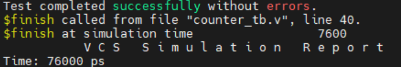

# 实验1 计数器
代码源文件 ：counter.v

测试文件 ： counter_tb.v

**要VCS与Verdi联合仿真，需要在testbench里面必须加入``ifdef FSDB到endif`的代码，这样才能生成fsdb文件提供Verdi读取，不然不会输出波形**

## 实验步骤

1. 使用vcs调用文件，对计数器进行功能仿真

2. 在Terminal输入代码并运行
```bash
vcs -R -full64 +v2k -fsdb +define+FSDB -sverilog counte_tb.v counter.v timescale.v -l run.log
```
解释如下：

- `-R`：指示VCS在编译完成后自动运行仿真，简化了操作流程。
- `-full64`：启用64位模式，适用于需要处理大数据或高性能计算的仿真。
- `+v2k`：指定使用Verilog-2001标准，确保兼容2001年版本的Verilog语法。
- `-fsdb`：启用FSDB格式支持，允许生成FSDB波形文件，以便配合Verdi等工具进行深入分析。
- `+define+FSDB`：相当于在Verilog代码中增加 `\`define FSDB`，可用于条件编译或配置相关设置。
- `-sverilog`：支持SystemVerilog语法，这样可以混合使用Verilog和SystemVerilog进行设计与验证。
- `counter.v tb_counter.v timescale.v`：需要编译和仿真的Verilog文件，可以按照任意顺序输入，不受文件顺序限制。
- `-l run.log`：将终端输出的信息保存到 `run.log` 文件中，方便查看仿真日志和错误信息，避免终端信息丢失。

3. Terminal出现如下图，并且文件夹里生成了fsdb文件，说明编译仿真成功


4. 接着我们可以用verdi来查看波形，在Terminal输入
```bash
verdi
```
点击File  -> import Design 
Language设置为Verilog-2001，接着在文件窗口选中需要的代码，点击右侧的+号，点击ok


接着按下图顺序操作


到这里我们可以看到波形


在波形窗口单击鼠标左键然后拖动可以缩放波形，然后按f键可以快速回到全局波形


 修改代码后，在terminal界面重新运行vcs命令
 ```
 vcs -R -full64 +v2k -fsdb +define+FSDB -sverilog -f main_counter.f -l run.log
```


接着在代码界面按shirt+L，可以快速刷新代码和波形
 


