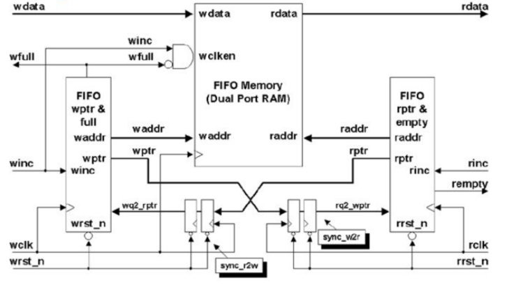
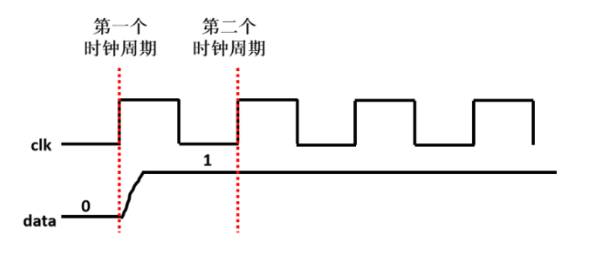
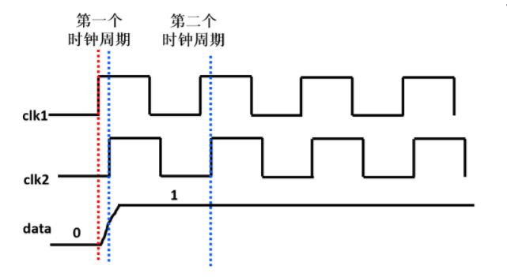
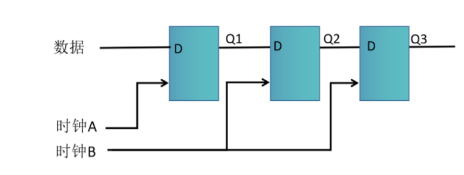

# 实验3 异步FIFO

## 1. 异步FIFO概述

异步FIFO（Asynchronous FIFO）是一种跨时钟域的数据缓冲结构，适用于读写时钟不一致的场景。其主要特点是**跨时钟域操作**，并通过**双口RAM**和**读写控制逻辑**实现数据存储与传输。

### 1.1 系统结构
异步FIFO的系统结构如下图所示：



### 1.2 关键特性
- **跨时钟域**：读写操作分别使用不同的时钟，频率、相位和来源可能不同。
- **数据完整性**：解决异步时钟引起的亚稳态问题，保证数据传输的正确性。
- **空满指示**：利用读写指针计算FIFO的状态，包括空、满、虚空与虚满状态。

---

## 2. 亚稳态问题及解决方案

### 2.1 亚稳态产生的原因

#### 同步时钟场景


在同步时钟中，时钟上升沿与数据跳变不同步，时钟采样可以准确捕获数据值。

#### 异步时钟场景



当时钟与数据跳变时间不一致时，时钟上升沿可能正好落在数据跳变区域，导致以下问题：
- **数据采样不确定**：输出值可能为`0`、`1`或中间不稳定电平。
- **亚稳态传播**：亚稳态可能影响后续电路的运行，导致系统不稳定。

### 2.2 解决方案
为解决亚稳态问题，常用的方法包括**打两拍同步机制**和**格雷码编码**。

#### 2.2.1 打两拍同步机制
通过两级D触发器对数据进行同步，减少亚稳态的传播概率。

**示意图**：

A时钟域 → Q1 → Q2 (B时钟域打2拍) → Q3



- **Q1**：数据进入目标时钟域的第一级触发器。
- **Q2**：可能出现亚稳态，通过第二级D触发器进一步稳定。
- **Q3**：数据在目标时钟域内安全使用。

**优势**：
- 两级同步触发器大大降低了亚稳态的传播概率。
- 实现简单，硬件开销小。

#### 2.2.2 使用格雷码编码

格雷码的特点是**相邻数据只有1位发生变化**，大大减少了亚稳态发生的概率。

- **二进制跳变问题**：
  例如从`3(0011)`到`4(0100)`，有3位数据发生跳变，亚稳态发生概率较高。
- **格雷码跳变优势**：
  相邻数据只发生1位变化，降低了亚稳态出现的可能性。

**二进制转格雷码方法**：
将二进制数右移一位并与原数按位异或，得到格雷码。

**示例**：

| 十进制 | 二进制 | 格雷码 |
|--------|--------|--------|
|   0    | 0000   | 0000   |
|   1    | 0001   | 0001   |
|   2    | 0010   | 0011   |
|   3    | 0011   | 0010   |
|   4    | 0100   | 0110   |
|   5    | 0101   | 0111   |
|   6    | 0110   | 0101   |
|   7    | 0111   | 0100   |
|   8    | 1000   | 1100   |
|   9    | 1001   | 1101   |
|  10    | 1010   | 1111   |
|  11    | 1011   | 1110   |
|  12    | 1100   | 1010   |
|  13    | 1101   | 1011   |
|  14    | 1110   | 1001   |
|  15    | 1111   | 1000   |


## 3. 空满状态判断

### 3.1 空状态判断
当**读地址指针**与**写地址指针**相等时，表示FIFO为空。

### 3.2 满状态判断
当**写地址指针**即将追上**读地址指针**时，表示FIFO已满。

### 3.3 虚空与虚满
- **虚空**：写指针同步到读时钟域时存在延迟，导致判断为空时实际仍在写入数据。
- **虚满**：读指针同步到写时钟域时存在延迟，导致判断为满时实际仍在读取数据。

**解决方案**：
- 精确同步读写指针，减少误判。
- 增加保护机制，避免数据丢失或覆盖。

---

## 4. FIFO深度选择

FIFO的深度取决于读写速率的关系和数据传输的需求：

- 写速率 > 读速率
需要根据连续写入的数据量（Burst Length）与读取数据量之间的差值，合理选择FIFO深度，以保证数据不会丢失。

- 读速率 > 写速率
FIFO深度设置为`1`即可满足需求，因为数据读取速度快于写入速度。

- 读写速率相同
FIFO深度设置为`1`即可保证数据传输的正确性。

---

### 5. 异步FIFO 参数与信号定义
| 信号         | 说明                                     |
|--------------|------------------------------------------|
| **clk**      | 系统时钟                                 |
| **rstn**     | 系统复位信号（低电平有效）               |
| **wr_en**    | 写使能信号，控制数据写入                 |
| **wr_data**  | 写入数据                                 |
| **fifo_full**| FIFO 满标志位，表示 FIFO 已满            |
| **rd_en**    | 读使能信号，控制数据读出                 |
| **rd_data**  | 读出数据                                 |
| **fifo_empty**| FIFO 空标志位，表示 FIFO 为空           |
| **读指针**   | 指向下一个要读出的地址                  |
| **写指针**   | 指向下一个要写入的地址                  |

## 6. 异步 FIFO 基本接口定义
```verilog
module async_fifo#(parameter BUF_SIZE=512, BUF_WIDTH=10) (
    input                      i_clk,       // 系统时钟
    input                      i_rst,       // 复位信号
    input                      i_w_en,      // 写使能信号
    input                      i_r_en,      // 读使能信号
    input      [BUF_WIDTH-1:0] i_data,      // 写入数据
   
    output reg [BUF_WIDTH-1:0] o_data,      // 读出数据
    output                     o_buf_empty, // FIFO 空标志位
    output                     o_buf_full   // FIFO 满标志位
);

    // 在此添加设计逻辑

endmodule
```

## 7. 双端口RAM
双端口ram介绍：
双端口RAM用于存储数据
```verilog
module ram_dual(RST, CLK_R, CLK_W, RD_EN, WRT_EN, ADDR_R, ADDR_W, DATA_WRT, DATA_RD);

parameter   DATA_WIDTH = 8;
parameter   RAM_DEEP   = 128;
parameter   ADDR_WIDTH = 7;

input		CLK_R;
input		CLK_W;
input		RST;
input		RD_EN;
input		WRT_EN;

input	[ADDR_WIDTH-1:0]    ADDR_R;
input	[ADDR_WIDTH-1:0]    ADDR_W;
input	[DATA_WIDTH-1:0]    DATA_WRT;

output	[DATA_WIDTH-1:0]    DATA_RD;

reg	[DATA_WIDTH-1:0]    DATA_RD;
reg	[DATA_WIDTH-1:0]    MEM	[0:RAM_DEEP-1];

// reg	[ADDR_WIDTH:0]    i;
// always @(posedge CLK_W or posedge RST) begin
//     if (RST) begin
// 	for(i=0; i<RAM_DEEP; i=i+1) begin
// 	    MEM[i] <= 0;
// 	    // #0.001;
// 	    // $display("iteration is %d", i);
// 	end
//     end
//     else if (WRT_EN)
// 	MEM[ADDR_W] <= DATA_WRT;
// end

generate
genvar i;
for (i=0; i<RAM_DEEP; i=i+1)
begin: MEM_GEN
    always @(posedge CLK_W or posedge RST) begin
	if (RST)
	    MEM[i] <= 0;
	else if (WRT_EN)
	    MEM[i] <= (ADDR_W == i) ? DATA_WRT : MEM[i];
    end
end
endgenerate


always @(posedge CLK_R or posedge RST) begin
    if (RST)
	DATA_RD <= 0;
    else if (RD_EN)
	DATA_RD <= MEM[ADDR_R];
end

endmodule
```

## 8. 设计实现要求
1. 完成 `async_fifo` 模块的 Verilog 代码设计,要求宽度为512，深度为10。
2. 例化双端口RAM用于存储数据。
3. 编写**测试文件**（Testbench）验证设计。
4. 最终检查：使用给定的 TB 文件验证设计的正确性。


